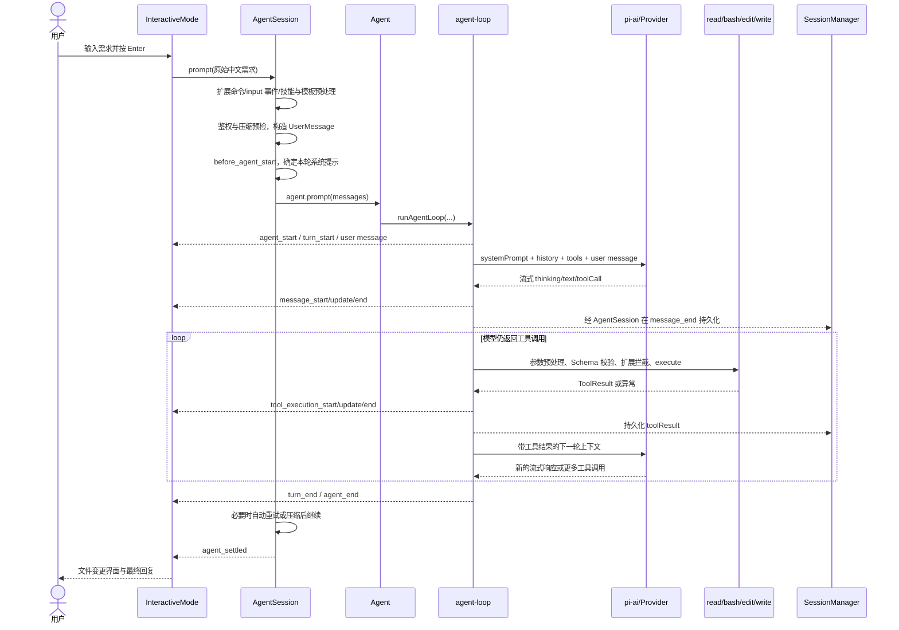

# 从“网页版炫酷贪吃蛇”需求看 pi 的完整执行流程

> 本文基于当前仓库 `@earendil-works/pi-coding-agent`、`@earendil-works/pi-agent-core` 与 `@earendil-works/pi-ai` 版本 `0.80.6` 的源码撰写。重点讨论用户在交互模式中输入：
>
> > 编写网页版的贪吃蛇,要求画面要炫酷,吸引眼球,添加动感的音效，能用高大上的框架就用框架
>
> 后，从按下 Enter 到代码落盘、模型完成回复的完整控制流。
>
> 所有引用基于 `F:\Project\agent\general\pi` 下的源码相对路径；项目使用 Node 22.19+ 风格模块，`@earendil-works/pi-coding-agent` 0.80.6、`@earendil-works/pi-agent-core` 0.80.6、`@earendil-works/pi-ai` 0.80.6。

## 1. 先给出结论：pi 不内置“贪吃蛇工作流”

pi 是一个极简、可扩展的编码代理运行框架，而不是把“分析需求—选 React—生成游戏—运行测试”硬编码在程序里的脚手架。源码中确定存在的是：

1. 启动 CLI，加载设置、项目上下文、技能、提示模板和扩展；
2. 创建会话，选择模型、思考等级与工具集合；
3. 将用户原始文本与系统提示、历史消息、工具定义一起发给模型；
4. 接收模型的流式文本、思考块和工具调用；
5. 校验并执行 `read`、`bash`、`edit`、`write` 等工具；
6. 将工具结果重新送回模型，循环到模型不再调用工具；
7. 持久化消息，更新 TUI，并输出最终说明。

至于模型会不会先提问、选 Phaser / React / Three.js 还是原生 Canvas、创建哪些文件、执行哪些命令，属于**模型在当前系统提示、项目文件、扩展和用户要求约束下的决策**。相同需求在不同模型、不同项目或不同设置下，工具调用轨迹可以不同。

因此，本文把流程分成两层：

- **确定性控制流**：由 pi 源码保证；
- **典型任务轨迹**：模型为完成该贪吃蛇需求很可能采取、但源码不保证完全一致的步骤。

## 2. 关键源码地图

| 层次 | 主要职责 | 关键源码 |
|---|---|---|
| CLI 入口 | 设置进程环境并进入主函数 | [`packages/coding-agent/src/cli.ts`](../packages/coding-agent/src/cli.ts) |
| 启动编排 | 参数、模式、信任、服务、会话和初始输入 | [`packages/coding-agent/src/main.ts`](../packages/coding-agent/src/main.ts) |
| 参数解析 | 区分选项、`@file` 和普通消息 | [`packages/coding-agent/src/cli/args.ts`](../packages/coding-agent/src/cli/args.ts) |
| 资源加载 | 扩展、技能、模板、主题、`AGENTS.md`、系统提示 | [`packages/coding-agent/src/core/resource-loader.ts`](../packages/coding-agent/src/core/resource-loader.ts) |
| 系统提示 | 组合工具说明、规则、上下文、技能、日期和 cwd | [`packages/coding-agent/src/core/system-prompt.ts`](../packages/coding-agent/src/core/system-prompt.ts) |
| 会话工厂 | 模型、鉴权、工具和 `AgentSession` 装配 | [`packages/coding-agent/src/core/sdk.ts`](../packages/coding-agent/src/core/sdk.ts) |
| 会话控制 | 提示预处理、扩展事件、重试、压缩、消息持久化 | [`packages/coding-agent/src/core/agent-session.ts`](../packages/coding-agent/src/core/agent-session.ts) |
| 交互模式 | 编辑器提交、TUI 渲染、队列与快捷键 | [`packages/coding-agent/src/modes/interactive/interactive-mode.ts`](../packages/coding-agent/src/modes/interactive/interactive-mode.ts) |
| 会话存储 | JSONL 追加写、树形分支和上下文重建 | [`packages/coding-agent/src/core/session-manager.ts`](../packages/coding-agent/src/core/session-manager.ts) |
| Agent 状态机 | 活跃运行、消息队列、事件监听与状态归约 | [`packages/agent/src/agent.ts`](../packages/agent/src/agent.ts) |
| Agent 循环 | 模型调用、工具执行、结果回灌和循环终止 | [`packages/agent/src/agent-loop.ts`](../packages/agent/src/agent-loop.ts) |
| 模型抽象 | Provider、鉴权应用、流式请求分发 | [`packages/ai/src/models.ts`](../packages/ai/src/models.ts) |
| 兼容分发 | coding-agent 当前使用的 `streamSimple()` 入口 | [`packages/ai/src/compat.ts`](../packages/ai/src/compat.ts) |
| 工具实现 | `read`、`bash`、`edit`、`write` 的真实副作用 | [`packages/coding-agent/src/core/tools/`](../packages/coding-agent/src/core/tools/) |

## 3. 总体时序



## 4. 阶段一：CLI 启动与运行环境准备

### 4.1 入口文件

npm 包把 `pi` 命令映射到 `dist/cli.js`。对应源码 [`cli.ts`](../packages/coding-agent/src/cli.ts) 会：

1. 设置 `process.title`；
2. 设置 `PI_CODING_AGENT=true`；
3. 配置基于 undici 的 HTTP dispatcher；
4. 调用 `main(process.argv.slice(2))`。

用户若先直接执行 `pi`，再在 TUI 中输入需求，那么该中文需求不是 CLI 参数；它在 TUI 主循环阶段才进入 `AgentSession.prompt()`。若执行：

```bash
pi "编写网页版的贪吃蛇,要求画面要炫酷,吸引眼球,添加动感的音效，能用高大上的框架就用框架"
```

则 `parseArgs()` 会把它放进 `parsed.messages`，随后由 `main()` 作为初始消息交给交互模式。两条路径最终都会进入同一个 `AgentSession.prompt()`。

### 4.2 参数与模式判定

[`parseArgs()`](../packages/coding-agent/src/cli/args.ts) 把输入分成：

- 已知选项，如 `--model`、`--thinking`、`--tools`；
- `@path` 文件参数；
- 普通消息；
- 可能由扩展注册的未知长选项。

[`resolveAppMode()`](../packages/coding-agent/src/main.ts) 决定运行模式：

- `--mode rpc`：RPC；
- `--mode json`：JSON 事件流；
- `-p`、stdin/stdout 非 TTY：print；
- 其他情况：interactive。

本文后续以 interactive 为主。其他模式的模型—工具循环相同，差别主要在输入输出层，见第 14 节。

### 4.3 Windows 与 Git Bash

pi 的 `bash` 工具在 Windows 上仍要求 Bash。解析顺序由 [`getShellConfig()`](../packages/coding-agent/src/utils/shell.ts) 定义：

1. `settings.json` 中的 `shellPath`；
2. `Program Files` 下标准 Git Bash 路径；
3. `PATH` 中的 `bash.exe`。

本机 Git 位于 `D:\Program Files\Git` 时，应配置：

```json
{
  "shellPath": "D:\\Program Files\\Git\\bin\\bash.exe"
}
```

创建内置工具时，`AgentSession._buildRuntime()` 从 `SettingsManager.getShellPath()` 读取这个值并传给 `createBashToolDefinition()`。真正执行命令时，Windows Git Bash 使用 `bash.exe -c <command>`。这只决定 shell 后端，不改变模型调用流程。

## 5. 阶段二：设置、项目信任、资源和会话创建

### 5.1 设置与项目信任

`main()` 先创建启动期 `SettingsManager`，再决定会话对应的最终 cwd。之所以先确定 cwd，是因为 `--session` 或 `--resume` 可能切换到另一项目；项目设置、资源和模型必须针对最终 cwd 加载。

若 cwd 中存在会执行动态代码或引入项目配置的资源，pi 会进行项目信任判断。未信任时，项目级 `.pi` 设置、扩展、包及项目技能不会直接启用；全局扩展和 CLI 显式扩展仍可参与 `project_trust` 事件。交互模式可弹出信任选择，非交互模式按全局 `defaultProjectTrust` 或 `--approve`/`--no-approve` 处理。

这会直接影响贪吃蛇任务。例如项目内若有一个“前端工程规范”技能或一个浏览器测试扩展，只有资源实际加载后，模型才能看到或调用它。

### 5.2 资源加载

`createAgentSessionServices()` 创建：

- `AuthStorage`；
- `SettingsManager`；
- `ModelRegistry`；
- `DefaultResourceLoader`。

`DefaultResourceLoader.reload()` 解析包并加载：

- 全局、项目及 CLI 扩展；
- skills；
- prompt templates；
- themes；
- 全局及从 cwd 向父目录查找的 `AGENTS.md`/`CLAUDE.md`；
- `.pi/SYSTEM.md`、全局 `SYSTEM.md`；
- `.pi/APPEND_SYSTEM.md`、全局 `APPEND_SYSTEM.md`。

加载顺序很重要：项目说明不是作为普通用户消息发送，而是进入系统提示。于是“使用什么包管理器”“是否允许安装依赖”“修改代码后运行什么检查”等项目规则，会约束模型如何完成贪吃蛇需求。

### 5.3 会话管理器

没有 `--continue`、`--resume`、`--session`、`--fork` 或 `--no-session` 时，`createSessionManager()` 调用 `SessionManager.create(cwd, sessionDir)` 创建新的持久化会话。

默认位置形如：

```text
~/.pi/agent/sessions/--<编码后的 cwd>--/<时间>_<session-id>.jsonl
```

会话是追加式树结构，每项有 `id` 和 `parentId`。新会话先在内存中拥有 header、初始模型变化项和思考等级变化项；源码会等到出现第一条 assistant 消息后再把这一批内容完整写入新文件，避免只输入但从未得到模型响应的空会话污染会话列表。

### 5.4 模型与思考等级

模型选择优先级大体为：

1. CLI 明确指定的模型；
2. 继续会话时恢复会话模型；
3. settings 中的默认 provider/model；
4. 有鉴权的可用模型。

思考等级来自 CLI、模型简写、会话记录或 settings，并由 `clampThinkingLevel()` 按模型能力钳制。若模型不支持 reasoning，最终为 `off`。

这里没有“前端需求自动切换更高级模型”的逻辑。“高大上的框架”描述只进入用户文本，不会修改 provider、model 或 thinking level。

### 5.5 默认工具

`createAgentSession()` 默认激活：

```text
read, bash, edit, write
```

`grep`、`find`、`ls` 虽已注册为内置工具，但默认不激活。扩展工具默认会加入活跃集合，除非 CLI allowlist/denylist 或扩展动态调整了集合。

所以在默认配置下，模型要查看目录，通常会调用 `bash` 执行 `ls`、`find` 或 `rg`；它不会调用未激活的独立 `ls` 工具。

## 6. 阶段三：构造系统提示

`AgentSession` 初始化运行时时会调用 `_rebuildSystemPrompt()`，最终由 [`buildSystemPrompt()`](../packages/coding-agent/src/core/system-prompt.ts) 生成系统提示。默认提示包含：

1. “你是运行在 pi 中的编码助手”这一角色；
2. 当前活跃工具的简短说明；
3. 工具附带的使用规则；
4. 通用规则，如回复简洁、显示清晰文件路径；
5. pi 自身文档路径及读取规则；
6. 所有加载到的项目上下文文件全文；
7. 可用技能的名称、描述和路径；
8. 当前日期和 cwd。

默认四个工具贡献的关键提示包括：

- `read`：用它读文件，不要用 `cat`/`sed` 代替；
- `edit`：精确替换，`oldText` 必须唯一；
- `write`：仅用于新文件或完整重写；
- `bash`：可执行 `ls`、`grep`、`find` 等命令。

技能采用渐进披露：系统提示通常只列技能元数据；当任务匹配时，模型应调用 `read` 打开对应 `SKILL.md`。若用户使用 `/skill:name`，`AgentSession` 会直接把技能正文扩展成带 `<skill>` 标签的用户内容。

## 7. 阶段四：用户按 Enter 后的 TUI 路径

### 7.1 编辑器提交

`InteractiveMode.setupEditorSubmitHandler()` 收到文本后先 `trim()`。该贪吃蛇需求：

- 不以 `/` 开头，所以不是内置命令、扩展命令、技能命令或提示模板；
- 不以 `!` 开头，所以不是用户直接执行的 Bash 命令；
- 若 Agent 空闲，也不进入 steering/follow-up 队列。

因此它走“Normal message submission”分支：

1. 将此前待显示的用户 Bash 组件移入聊天区；
2. 把文本交给 `getUserInput()` 的等待者；
3. 加入编辑器历史。

`InteractiveMode.run()` 的主循环随后执行：

```ts
await this.session.prompt(userInput);
```

这个 `await` 不只等待一次 HTTP 请求，而是等待本次完整 Agent 运行，包括所有模型—工具往返、自动重试、必要的压缩重试和已排队的延续消息。

### 7.2 正在运行时再次提交

若用户在 pi 生成代码期间再次按 Enter，TUI 调用：

```ts
session.prompt(text, { streamingBehavior: "steer" })
```

该消息会在当前 assistant turn 的工具全部执行完后、下一次模型调用前注入。Alt+Enter 使用 `followUp`，只在当前任务本来要停止时再注入。Escape 会清空队列、把内容恢复到编辑器并中止运行。

这意味着用户可以在贪吃蛇制作途中追加：“不要 React，改用 Phaser”“增加移动端虚拟方向键”等要求，而不需要等待整个任务结束。

## 8. 阶段五：`AgentSession.prompt()` 的完整预处理

对这条普通中文需求，`AgentSession.prompt()` 依次执行以下逻辑。

### 8.1 扩展命令检查

只有文本以 `/` 开头且匹配扩展命令时才会立即执行命令 handler。当前文本不匹配，继续。

### 8.2 `input` 扩展事件

若扩展注册了 `input` handler，原始文本会先通过扩展链。扩展可以：

- `continue`：原样继续；
- `transform`：改写文本或图片；
- `handled`：自行处理并完全绕过模型。

因此源码能保证的是“扩展有机会改写该需求”，不能保证模型最终看到的字面文本一定不变。在无相关扩展时，模型看到原始中文。

### 8.3 技能和模板展开

接着尝试：

1. `/skill:name`；
2. `/template`。

本需求不是斜杠命令，所以不发生展开。模型仍可能依据系统提示中的技能描述，自主调用 `read` 加载前端相关 skill。

### 8.4 模型、鉴权与压缩预检

空闲状态下会：

1. 刷新此前待并入上下文的用户 Bash 消息；
2. 检查是否有模型；
3. 快速检查该模型是否配置了鉴权；
4. 检查上一次中止响应是否使上下文需要先压缩。

实际请求时，`ModelRegistry.getApiKeyAndHeaders()` 才解析 runtime key、`auth.json`、OAuth、环境变量或 `models.json` 配置。OAuth 过期时会在文件锁保护下刷新，避免多个 pi 进程重复刷新。

### 8.5 构造用户消息

文本被包装成：

```ts
{
  role: "user",
  content: [{ type: "text", text: "编写网页版的贪吃蛇,..." }],
  timestamp: Date.now()
}
```

pi 不先翻译、不做需求分类，也不在本地把“炫酷”“音效”“框架”拆成字段；语义理解发生在模型侧。如果还附带图片，图片块会追加到同一 `content` 数组。

### 8.6 `before_agent_start` 扩展事件

在真正调用 Agent 前，扩展还可：

- 注入持久化 custom message；
- 修改本轮 system prompt。

修改只影响本轮，运行结束后 `_systemPromptOverride` 会被清除并恢复基础系统提示。

## 9. 阶段六：第一次模型调用

### 9.1 从 `AgentSession` 到 `Agent`

`AgentSession._runAgentPrompt()` 标记运行活跃，调用 `agent.prompt(messages)`。`Agent` 创建 `AbortController`，设置 `state.isStreaming=true`，然后进入 `runAgentLoop()`。

事件起始顺序是：

```text
agent_start
turn_start
message_start(user)
message_end(user)
```

`Agent.processEvents()` 先更新内部状态，再按订阅顺序等待 listener。`AgentSession` 的内部 listener 会：

1. 转发对应扩展事件；
2. 转发给 TUI；
3. 在 `message_end` 时把 user/assistant/toolResult 追加到 `SessionManager`。

所以用户消息会很快显示在聊天区，同时进入会话树。

### 9.2 每次请求前的上下文变换

`streamAssistantResponse()` 在每次模型请求前执行：

1. `transformContext`：在 coding-agent 中对应扩展 `context` 事件；
2. `convertToLlm`：把内部 `AgentMessage[]` 转成 provider 可理解的标准消息；
3. 组装 `Context`：`systemPrompt + messages + tools`。

`convertToLlm()` 的重要行为包括：

- 普通 user/assistant/toolResult 原样保留；
- 扩展 custom message 转为 user message；
- `!command` 的执行结果转为 user 文本；
- `!!command` 结果排除出模型上下文；
- compaction/branch summary 转为带 `<summary>` 的 user 文本。

### 9.3 鉴权和 provider 协议

`createAgentSession()` 给 `Agent` 注入了自定义 `streamFn`。它会：

1. 调用 `ModelRegistry.getApiKeyAndHeaders()`；
2. 合并 provider attribution、自定义 headers 和环境；
3. 触发扩展 `before_provider_headers`；
4. 调用 pi-ai 的 `streamSimple()`；
5. 在请求 payload 生成后触发 `before_provider_request`；
6. 收到 HTTP 响应后触发 `after_provider_response`。

pi-ai 再依据模型的 `api` 字段分发到 Anthropic Messages、OpenAI Responses、OpenAI Completions、Google、Mistral、Bedrock 等具体实现。API 实现负责：

- 将统一消息和 TypeBox 工具 Schema 转成厂商格式；
- 设置 reasoning、最大 token、缓存和 transport 参数；
- 发起流式 HTTP/WebSocket 请求；
- 把厂商事件统一成 `text_*`、`thinking_*`、`toolcall_*`、`done`、`error`；
- 统计 token、缓存与费用。

因此中文需求不会被 pi 本地“解析成代码”；pi 只是提供上下文和工具，真正的语义推理与工具选择由当前 LLM 完成。

## 10. 阶段七：模型如何把需求转化为工程动作

以下是**典型但非硬编码**的模型决策过程。

### 10.1 先判断项目状态

模型从系统提示已知 cwd 和项目规则，但并不知道所有文件内容。为了避免盲目覆盖，它通常会先检查：

- 当前目录有什么；
- 是否已有 `package.json`；
- 已经使用 React / Vue / Svelte / Phaser / Three.js 还是纯静态页面；
- 入口文件、构建命令、样式体系和测试配置；
- 项目说明是否要求特定目录或命令。

默认工具没有独立 `ls`，因此典型调用可能是：

```json
{
  "name": "bash",
  "arguments": {
    "command": "pwd && find . -maxdepth 2 -type f | sort | head -200"
  }
}
```

随后用 `read` 查看 `package.json`、已有入口和样式文件。

如果目标目录不明确、仓库明显不是 Web 应用、存在多套前端工程，模型也可能先向用户提问。pi 核心没有“遇到歧义必须询问”的强制规则。

### 10.2 选择技术方案

“能用高大上的框架就用框架”不是一个精确技术约束。一个合理模型可能综合现有项目做出以下选择之一：

- 已有 React/Vite：继续用 React，Canvas 绘制游戏；
- 游戏项目已有 Phaser：使用 Phaser；
- 空目录且允许安装依赖：创建 Vite + TypeScript 项目，再选 React/Phaser；
- 依赖安装受限：使用原生 Canvas、CSS 和 Web Audio API；
- 视觉目标很高且运行成本可接受：使用 Three.js/WebGL。

pi 不会因为出现“高大上”三个字自动执行 `npm install`。只有模型明确返回 `bash` 工具调用后，依赖安装才会发生；项目 `AGENTS.md` 还可以禁止、限制或规定安装命令。

### 10.3 将自然语言转成验收点

高质量模型通常会把需求隐式分解为：

- 基本玩法：移动、吃食物、增长、碰撞、计分、重开；
- 视觉：霓虹配色、粒子、辉光、渐变、动态背景、屏幕震动或过渡；
- 交互：键盘方向键/WASD，可能附加移动端按钮；
- 音效：吃食物、转向、碰撞、开始/暂停；
- 浏览器限制：在首次用户交互后创建或恢复 `AudioContext`，避免 autoplay 限制；
- 工程：响应式布局、可运行脚本、构建或类型检查。

这些验收点来自模型能力，不是 pi 核心内置检查器。模型可能遗漏其中某项，pi 不会自动证明“画面足够炫酷”或“音效足够动感”。

## 11. 阶段八：工具调用、执行与回灌

### 11.1 模型返回工具调用

provider 的流中一旦出现 tool call，pi-ai 逐步解析参数并发出：

```text
toolcall_start
toolcall_delta ...
toolcall_end
```

Agent 将部分 assistant message 通过 `message_update` 持续推给 TUI。交互界面可在参数尚未完整时先显示将要读取、写入或执行的目标。

assistant message 完成后产生 `message_end`。该消息可能只有工具调用，也可能同时包含说明文字、thinking block 和多个工具调用。消息会在工具真正执行前进入 Agent 状态并由 `AgentSession` 持久化；因此扩展的 `tool_call` handler 能看到提出该调用的 assistant 消息。

### 11.2 工具参数校验与扩展拦截

每个调用进入 `prepareToolCall()`：

1. 按名称查找活跃工具；
2. 执行可选 `prepareArguments()` 兼容转换；
3. 按 TypeBox Schema 校验参数；
4. 调用 `beforeToolCall`，在 coding-agent 中映射为扩展 `tool_call` 事件；
5. 若扩展返回 `block: true`，生成错误工具结果而不执行副作用。

这使扩展可以实现权限确认、危险命令阻断或受保护路径检查。pi 核心默认不弹权限确认框。

### 11.3 默认并行执行

Agent 默认 `toolExecution="parallel"`：同一 assistant message 中的工具先按源顺序做预检，通过后并发执行。若其中任一工具声明 `executionMode="sequential"`，整批改成顺序执行。

对于贪吃蛇任务，模型可能在一个响应里并行创建不同文件，例如：

```text
write index.html
write src/main.ts
write src/style.css
```

`edit` 和 `write` 还使用按真实文件路径划分的 mutation queue。同一路径的并发修改会串行，避免两个工具都基于旧内容写回而互相覆盖；不同路径仍可并行。

### 11.4 四个默认工具在本任务中的作用

#### `read`

- 解析相对或绝对路径；
- 文本默认最多返回 2000 行或 50KB；
- 可通过 `offset`/`limit` 分段继续；
- 图片会转换成模型图片附件；
- 不支持视觉的模型只收到说明文本。

典型用途：读 `package.json`、现有页面、构建配置和刚生成但需要修正的文件。

#### `bash`

- 在 cwd 中运行 Bash；
- 同时收集 stdout/stderr；
- 可流式更新 TUI；
- 最终只保留末尾 2000 行或 50KB，完整超限输出写到临时文件；
- 非零退出、超时或中止会抛异常，并被 Agent 转成 `isError=true` 的工具结果。

典型用途：查看目录、安装依赖、执行脚手架、类型检查或项目允许的验证命令。Windows 上使用第 4.3 节所述 Git Bash。

#### `write`

- 自动创建父目录；
- 新建或完整覆盖文件；
- 返回写入字节数；
- 进入文件 mutation queue。

典型用途：在新项目中创建 `package.json`、HTML、TypeScript、CSS 和配置文件。

#### `edit`

- 读取原文件；
- 每个 `oldText` 必须在原文件中唯一匹配；
- 同一调用中的多处替换都以原始内容为基准；
- 保留 BOM 和原换行风格；
- 返回展示 diff 和标准 unified patch。

典型用途：根据类型检查错误、运行结果或二次审查修正已存在文件。

### 11.5 工具结果回到模型

工具完成后依次发生：

1. 可选 `afterToolCall`，即扩展 `tool_result` 事件，可改写结果；
2. `tool_execution_end`；
3. 构造标准 `ToolResultMessage`；
4. `message_start(toolResult)`；
5. `message_end(toolResult)`；
6. 追加到当前上下文与会话 JSONL。

即使工具并行完成，最终 toolResult 消息仍按 assistant 原始调用顺序进入上下文。这样 provider 看到的 tool call/result 对应关系稳定。

### 11.6 自动进入下一轮

只要本批工具没有全部返回 `terminate: true`，Agent 内层循环就会再次调用模型。下一次请求包含：

- 同一系统提示；
- 原始贪吃蛇需求；
- 模型刚才的 assistant tool call；
- 每个工具的结果；
- 当前活跃工具定义。

模型据此继续：例如先读项目，第二轮创建文件，第三轮运行检查，第四轮根据报错编辑，再到最后一轮输出总结。

## 12. 一个合理的典型执行轨迹

下面的表格用于说明循环如何展开，不代表源码强制的唯一轨迹。

| 轮次 | 模型可能采取的动作 | pi 的确定性行为 |
|---|---|---|
| 1 | 用 `bash` 查看目录，再用 `read` 读 `package.json` | 校验调用，执行工具，把目录和文件内容回灌 |
| 2 | 确定沿用现有框架，或创建 Vite/Phaser/React 工程 | 若需安装依赖，只有模型调用 `bash` 后才执行 |
| 3 | 用多个 `write` 创建游戏逻辑、样式、页面和音效模块 | 不同文件可并行写入；TUI 实时显示文件内容预览 |
| 4 | 用 `bash` 运行项目允许的类型检查或静态检查 | 流式展示命令输出；失败作为错误工具结果返回模型 |
| 5 | 用 `read`/`edit` 修复类型、导入、尺寸或音频初始化问题 | 精确替换并生成 diff，再把结果返回模型 |
| 6 | 做最后审查，必要时继续修改 | 模型仍可无限继续调用工具，直到主动停止 |
| 7 | 输出“完成了什么、如何运行、文件在哪” | assistant 无 tool call 后结束 Agent 循环并显示最终文本 |

如果项目是空目录，一种可能的产物结构是：

```text
package.json
index.html
src/
  main.ts
  game.ts
  audio.ts
  style.css
```

如果项目已有框架，模型更可能只修改现有 `src`。pi 不会固定创建上述结构。

## 13. TUI 如何实时呈现整个过程

`InteractiveMode.handleEvent()` 把事件映射到组件：

- `agent_start`：显示 Working 指示器；
- `message_start(user)`：显示用户需求；
- `message_start/update(assistant)`：创建并增量更新 assistant 组件；
- 流式 tool call：提前创建 `ToolExecutionComponent` 并更新参数；
- `tool_execution_start`：标记工具开始；
- `tool_execution_update`：显示 Bash 流式输出等部分结果；
- `tool_execution_end`：显示最终输出、错误或 diff；
- `agent_end`：清理 working 状态；
- `agent_settled`：表示重试、压缩和队列也都处理完毕。

`Ctrl+O` 只改变工具输出展开状态，不改变发给模型的工具结果。thinking block 是否显示也只影响 TUI；模型 reasoning 能力和实际请求参数由 thinking level 决定。

## 14. 会话持久化后会记录什么

正常完成一轮“查看—创建—验证—修复”的任务后，JSONL 大致包含：

```text
session header
model_change
thinking_level_change
message(user: 贪吃蛇需求)
message(assistant: read/bash tool calls)
message(toolResult: 项目结构)
message(toolResult: package.json 内容)
message(assistant: write tool calls)
message(toolResult: 写文件结果)
message(assistant: bash 检查调用)
message(toolResult: 检查输出)
message(assistant: edit 调用)
message(toolResult: diff/patch details)
message(assistant: 最终说明)
```

每项通过 `parentId` 指向当前叶子，形成可分支树。工具结果的 `details` 也会存储，因此 `edit` 的 diff/patch 可用于 TUI 恢复显示。会话恢复时，`buildSessionContext()` 沿当前叶子回溯，并考虑 compaction、branch summary、模型和 thinking level 变化，重建下一次请求所需上下文。

## 15. 重试、压缩、中止和失败路径

### 15.1 Provider 错误

pi-ai 不把常规请求错误直接抛出流之外，而是生成：

- `error` 流事件；
- `stopReason="error"` 的 assistant message；
- `errorMessage` 和已有部分内容。

`AgentSession` 对可重试错误按设置做指数退避。重试时会从 Agent 活跃上下文移除错误 assistant message，但历史记录仍保留该失败。

### 15.2 上下文溢出与自动压缩

若 provider 报上下文溢出，或 token 使用达到阈值，`AgentSession` 可：

1. 触发 `compaction_start`；
2. 让扩展接管或由默认 summarizer 生成摘要；
3. 追加 compaction entry；
4. 用摘要和保留的近期消息重建上下文；
5. 对溢出场景重试一次。

因此长时间迭代贪吃蛇项目时，较早的工具交互可能被摘要替代，但原始 JSONL 历史仍在。

### 15.3 工具失败

常见失败包括：

- `read` 读取不存在或越界（被自动截断为 50KB/2000 行，模型应按提示继续用 `offset`）；
- `edit` 因 `oldText` 不唯一失败；
- `bash` 退出码非零、超时或被中止；
- `write` 在只读卷或权限不足的目录失败。

所有失败都生成 `isError=true` 的工具结果返回模型。模型决定是否修正后再次调用；用户也可以按 Escape 中断、由 TUI 把队列内容恢复到编辑器。

### 15.4 Abort、Ctrl+C、SIGINT/SIGTERM/SIGHUP

交互模式下：

- Escape：取消当前运行并恢复队列；
- 一次 `Ctrl+C`：清空编辑器；连按两次：退出；
- `Ctrl+Z`：挂起到后台；
- `SIGTERM/SIGHUP`：触发 graceful shutdown；
- 死终端：紧急 `process.exit(129)`，不运行常规清理。

所有路径都会调用 `dispose()` 释放 `AgentSession` 和会话、终止 detached 子进程、停止主题监听。

## 16. 非交互与脚本化场景

`pi -p "..."` 会进入 `runPrintMode()`：

- 模型—工具循环与交互模式完全相同；
- 全部 `AgentSessionEvent` 序列按 `--mode json` 序列化为 JSON 行输出到 stdout；
- 文本模式仅把最后一条 assistant 文本写入 stdout。

`pi --mode rpc` 暴露 JSON-RPC over stdin/stdout。SDK 用户可以 `import { createAgentSession }` 直接得到 `AgentSession`，自行装配 UI、扩展或自动化。

因此无论是后台批处理、CI 中修复测试，还是交互式游戏开发，pi 都通过同一个 `AgentSession` + `Agent` + `agent-loop` + `pi-ai Provider` 流水线运行。

## 17. 总结：源码保证了什么、模型决定了什么

源码保证：

1. 进入 `AgentSession.prompt()` 的文本经过 `input` 扩展、技能、模板、鉴权与压缩预检后变成合法的 `UserMessage`；
2. 模型总是看到完整系统提示、可用工具和当前会话上下文；
3. 工具调用经 Schema 校验、`prepareArguments` 兼容、扩展拦截和 mutation queue 保护后，真实执行或被替换为错误结果；
4. 工具结果按 assistant 原始顺序回灌；
5. assistant 不再调用工具时循环结束，事件流完成 `agent_end` 和 `agent_settled`；
6. 整轮交互以 JSONL 树结构增量写入会话文件，支持 `/resume`、`/tree`、`/fork`、`/compact`、`/export`、`/share`；
7. Windows 平台下 `bash` 工具的底层 shell 由 `settings.json` 的 `shellPath` 决定。

模型决定：

1. 何时开始“先看项目再动手”；
2. 选择 Phaser / React / Three.js / 原生 Canvas 中的哪一套；
3. 是否在创建文件前先 `bash` 装依赖；
4. 怎么用 Canvas + Web Audio 写出“炫酷画面”和“动感音效”；
5. 是否在出错时继续修复，或者放弃并向用户说明。

下一节给出可用于本地复现该需求轨迹的最少步骤。

## 18. 复现该需求的最小步骤

```bash
# 1. 让 pi 找到 Git Bash
echo '{
  "shellPath": "D:\\Program Files\\Git\\bin\\bash.exe"
}' > ~/.pi/agent/settings.json

# 2. 准备一个目标目录
mkdir snake && cd snake

# 3. 启动 pi
pi

# 4. 在 TUI 中输入并按 Enter
编写网页版的贪吃蛇,要求画面要炫酷,吸引眼球,添加动感的音效，能用高大上的框架就用框架
```

之后可以在 TUI 内随时追加“改成 Phaser”、“增加音效”“把背景调成霓虹渐变”等。也可以在任意轮按 `Ctrl+O` 折叠工具结果，查看模型对 `package.json`、`src/main.ts` 等的修改 diff。会话文件位于 `~/.pi/agent/sessions/--<编码后的工作目录>--/` 下，可随时 `--continue`、`--resume` 或 `/tree` 回到任意分叉。

## 19. 进一步阅读

- [`packages/coding-agent/README.md`](../packages/coding-agent/README.md)
- [`packages/coding-agent/docs/sdk.md`](../packages/coding-agent/docs/sdk.md)
- [`packages/coding-agent/docs/extensions.md`](../packages/coding-agent/docs/extensions.md)
- [`packages/coding-agent/docs/skills.md`](../packages/coding-agent/docs/skills.md)
- [`packages/coding-agent/docs/sessions.md`](../packages/coding-agent/docs/sessions.md)
- [`packages/coding-agent/docs/compaction.md`](../packages/coding-agent/docs/compaction.md)
- [`packages/coding-agent/docs/session-format.md`](../packages/coding-agent/docs/session-format.md)
- [`packages/coding-agent/docs/providers.md`](../packages/coding-agent/docs/providers.md)
- [`packages/coding-agent/docs/json.md`](../packages/coding-agent/docs/json.md)
- [`packages/agent/README.md`](../packages/agent/README.md)
- [`packages/ai/README.md`](../packages/ai/README.md)
